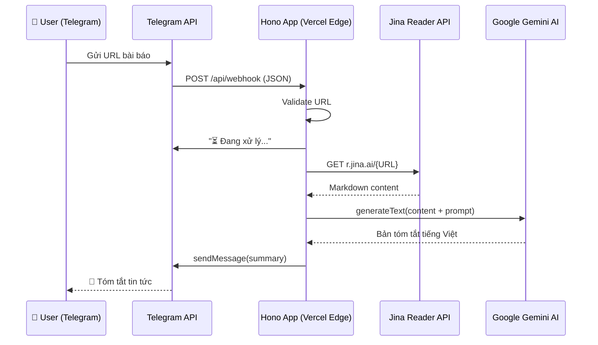

# Chopper News — Telegram Bot Tóm Tắt Tin Tức

Bot Telegram nhận URL bài báo → trích xuất nội dung qua Jina Reader → tóm tắt bằng Gemini AI → gửi lại người dùng bằng tiếng Việt.

## User Review Required

> [!IMPORTANT]
> **API Keys cần chuẩn bị trước khi code:**
> 1. **Telegram Bot Token** — Chat `@BotFather` → `/newbot` → lưu token
> 2. **Google Gemini API Key** — Lấy từ [Google AI Studio](https://aistudio.google.com/)
> 3. **Jina Reader API Key** (tùy chọn) — Miễn phí không cần key, nhưng có key sẽ tăng rate limit

> [!WARNING]
> **Lựa chọn parse_mode cho Telegram:**
> MarkdownV2 của Telegram rất khắt khe — phải escape nhiều ký tự đặc biệt (`_`, `*`, `[`, `]`, `(`, `)`, `~`, `` ` ``, `>`, `#`, `+`, `-`, `=`, `|`, `{`, `}`, `.`, `!`).
> Plan này sẽ dùng **HTML parse_mode** thay vì MarkdownV2 để đơn giản hóa việc format, vì output từ AI (Markdown) cần được convert sang HTML trước khi gửi. Nếu bạn muốn dùng MarkdownV2, hãy cho mình biết.

---

## Kiến trúc hệ thống



---

## Cấu trúc Project

```
chopper-news/
├── api/
│   └── index.ts              # Entry point — Hono app export cho Vercel
├── src/
│   ├── bot/
│   │   ├── handler.ts         # Xử lý logic chính từ Telegram webhook
│   │   └── commands.ts        # Xử lý các commands (/start, /help)
│   ├── services/
│   │   ├── jina.ts            # Gọi Jina Reader API
│   │   ├── ai.ts              # Gọi Gemini AI tóm tắt
│   │   └── telegram.ts        # Gọi Telegram Bot API (sendMessage, etc.)
│   ├── utils/
│   │   ├── url.ts             # Validate URL
│   │   ├── text.ts            # Truncate/split message, convert MD→HTML
│   │   └── logger.ts          # Simple logger
│   └── config.ts              # Env vars + constants
├── .env.example               # Template biến môi trường
├── .gitignore
├── package.json
├── tsconfig.json
└── vercel.json                # Routing config
```

---

## Proposed Changes

### Component 1: Project Initialization

#### [NEW] [package.json](file:///e:/code/project/hono/chopper-news/package.json)
- Dependencies: `hono`, `ai`, `@ai-sdk/google`
- DevDependencies: `@types/node`, `typescript`, `vercel`
- Scripts: `dev` (vercel dev), `deploy` (vercel deploy)

#### [NEW] [tsconfig.json](file:///e:/code/project/hono/chopper-news/tsconfig.json)
- Target: `ESNext`, Module: `ESNext`, strict mode
- Path aliases: `@/*` → `src/*`

#### [NEW] [vercel.json](file:///e:/code/project/hono/chopper-news/vercel.json)
- Rewrites: tất cả requests → `/api`
- Đảm bảo Telegram webhook POST đến đúng Hono app

#### [NEW] [.env.example](file:///e:/code/project/hono/chopper-news/.env.example)
```env
TELEGRAM_BOT_TOKEN=your_bot_token_here
GOOGLE_GENERATIVE_AI_API_KEY=your_gemini_api_key_here
JINA_API_KEY=optional_jina_api_key
```

#### [NEW] [.gitignore](file:///e:/code/project/hono/chopper-news/.gitignore)
- `node_modules/`, `.env`, `.vercel/`

---

### Component 2: Hono App Entry Point

#### [NEW] [api/index.ts](file:///e:/code/project/hono/chopper-news/api/index.ts)
- Import Hono, setup basePath `/api`
- Route `POST /webhook` → gọi `handleWebhook()`
- Route `GET /` → health check
- Export default qua `handle(app)` cho Vercel adapter

```typescript
// Pseudo-code
import { Hono } from 'hono'
import { handle } from 'hono/vercel'
import { handleWebhook } from '../src/bot/handler'

const app = new Hono().basePath('/api')

app.get('/', (c) => c.json({ status: 'Chopper News Bot is running 🚀' }))

app.post('/webhook', async (c) => {
  const body = await c.req.json()
  // Fire-and-forget pattern: respond 200 immediately to Telegram
  // then process in background via waitUntil
  c.executionCtx.waitUntil(handleWebhook(body))
  return c.json({ ok: true })
})

export default handle(app)
```

> [!TIP]
> **Sử dụng `waitUntil` pattern:** Trả về `200 OK` ngay lập tức cho Telegram (tránh timeout), sau đó xử lý logic trong background. Đây là best practice cho serverless webhook handlers.

---

### Component 3: Bot Logic

#### [NEW] [src/bot/handler.ts](file:///e:/code/project/hono/chopper-news/src/bot/handler.ts)
Logic chính:
1. Parse Telegram Update object → lấy `message.text` và `chat.id`
2. Kiểm tra nếu là command (`/start`, `/help`) → delegate sang `commands.ts`
3. Kiểm tra nếu text là URL hợp lệ → bắt đầu quy trình tóm tắt:
   - Gửi typing indicator + tin nhắn "⏳ Đang đọc bài viết..."
   - Gọi `fetchContent(url)` từ Jina service
   - Gọi `summarize(content)` từ AI service
   - Gửi kết quả tóm tắt về Telegram
4. Nếu không phải URL → gửi hướng dẫn sử dụng

#### [NEW] [src/bot/commands.ts](file:///e:/code/project/hono/chopper-news/src/bot/commands.ts)
- `/start` → Tin nhắn chào mừng + hướng dẫn sử dụng
- `/help` → Danh sách tính năng & cách dùng

---

### Component 4: Services

#### [NEW] [src/services/jina.ts](file:///e:/code/project/hono/chopper-news/src/services/jina.ts)
```typescript
// Pseudo-code
export async function fetchContent(url: string): Promise<string> {
  const response = await fetch(`https://r.jina.ai/${url}`, {
    headers: {
      'Accept': 'text/markdown',
      // 'Authorization': `Bearer ${JINA_API_KEY}` // optional
    }
  })
  
  if (!response.ok) throw new Error(`Jina Reader failed: ${response.status}`)
  
  const content = await response.text()
  
  // Truncate nếu quá dài (tránh vượt token limit của AI)
  return truncateForAI(content, 15000) // ~15k chars ≈ ~4k tokens
}
```

#### [NEW] [src/services/ai.ts](file:///e:/code/project/hono/chopper-news/src/services/ai.ts)
```typescript
// Pseudo-code
import { google } from '@ai-sdk/google'
import { generateText } from 'ai'

const SYSTEM_PROMPT = `Bạn là một trợ lý tóm tắt tin tức chuyên nghiệp.
Hãy đọc nội dung bài viết sau và tóm tắt thành 3-5 ý chính bằng tiếng Việt.

Quy tắc:
- Sử dụng định dạng HTML đơn giản (dùng <b>, <i>, <a> tags)
- Bắt đầu bằng tiêu đề bài viết in đậm
- Mỗi ý chính là một bullet point (• )
- Cuối cùng ghi nguồn bài viết
- Giữ tổng độ dài dưới 3500 ký tự`

export async function summarize(content: string, sourceUrl: string): Promise<string> {
  const { text } = await generateText({
    model: google('gemini-2.0-flash'),
    system: SYSTEM_PROMPT,
    prompt: `Nội dung bài viết từ ${sourceUrl}:\n\n${content}`,
  })
  return text
}
```

> [!NOTE]
> Chọn `gemini-2.0-flash` vì: nhanh (~1-2s), miễn phí tier rộng rãi (15 RPM / 1M tokens/ngày), chất lượng đủ tốt cho tóm tắt.

#### [NEW] [src/services/telegram.ts](file:///e:/code/project/hono/chopper-news/src/services/telegram.ts)
```typescript
// Pseudo-code
const TELEGRAM_API = `https://api.telegram.org/bot${BOT_TOKEN}`

export async function sendMessage(chatId: number, text: string): Promise<void> {
  // Split message nếu > 4000 ký tự
  const chunks = splitMessage(text, 4000)
  for (const chunk of chunks) {
    await fetch(`${TELEGRAM_API}/sendMessage`, {
      method: 'POST',
      headers: { 'Content-Type': 'application/json' },
      body: JSON.stringify({
        chat_id: chatId,
        text: chunk,
        parse_mode: 'HTML',
        disable_web_page_preview: true,
      }),
    })
  }
}

export async function sendTypingAction(chatId: number): Promise<void> {
  await fetch(`${TELEGRAM_API}/sendChatAction`, {
    method: 'POST',
    headers: { 'Content-Type': 'application/json' },
    body: JSON.stringify({ chat_id: chatId, action: 'typing' }),
  })
}
```

---

### Component 5: Utilities

#### [NEW] [src/utils/url.ts](file:///e:/code/project/hono/chopper-news/src/utils/url.ts)
- `isValidUrl(text: string): boolean` — kiểm tra URL hợp lệ bằng `URL` constructor
- Chỉ chấp nhận `http://` và `https://` protocols

#### [NEW] [src/utils/text.ts](file:///e:/code/project/hono/chopper-news/src/utils/text.ts)
- `splitMessage(text: string, maxLength: number): string[]` — cắt message thông minh theo paragraph/newline
- `truncateForAI(content: string, maxChars: number): string` — cắt nội dung quá dài trước khi gửi AI
- `escapeHtml(text: string): string` — escape ký tự HTML đặc biệt

#### [NEW] [src/utils/logger.ts](file:///e:/code/project/hono/chopper-news/src/utils/logger.ts)
- Simple console logger với timestamp & log levels

#### [NEW] [src/config.ts](file:///e:/code/project/hono/chopper-news/src/config.ts)
- Load & validate env variables
- Export constants: `BOT_TOKEN`, `GEMINI_API_KEY`, `JINA_API_KEY`

---

## Xử lý Edge Cases & Error Handling

| Scenario | Xử lý |
|---|---|
| URL không hợp lệ | Gửi tin nhắn: "❌ URL không hợp lệ. Vui lòng gửi link bắt đầu bằng http:// hoặc https://" |
| Jina Reader lỗi / timeout | Gửi: "❌ Không thể đọc nội dung trang web. Vui lòng thử lại sau." |
| AI response lỗi | Gửi: "❌ Có lỗi khi tóm tắt. Vui lòng thử lại sau." |
| Nội dung quá dài (>4096 chars) | Tự động split thành nhiều message |
| Nội dung Jina quá dài cho AI | Truncate xuống ~15000 chars trước khi gửi AI |
| Empty content từ Jina | Gửi: "❌ Trang web không có nội dung để tóm tắt." |

---

## Quy trình Deploy

### Bước 1: Setup local
```bash
# Trong thư mục chopper-news/
npm install
cp .env.example .env
# Điền API keys vào .env
```

### Bước 2: Test local
```bash
npm run dev
# → http://localhost:3000/api
# Dùng curl hoặc Postman để test POST /api/webhook
```

### Bước 3: Deploy lên Vercel
```bash
vercel deploy
# Hoặc connect GitHub repo trên Vercel Dashboard
# Set environment variables trên Vercel Dashboard
```

### Bước 4: Set Telegram Webhook
```bash
curl -X POST "https://api.telegram.org/bot<TOKEN>/setWebhook?url=https://your-app.vercel.app/api/webhook"
```

---

## Open Questions

> [!IMPORTANT]
> 1. **Bạn đã có Telegram Bot Token chưa?** Nếu chưa, mình sẽ bỏ qua bước setup webhook và bạn có thể set sau.
> 2. **Bạn muốn dùng Gemini hay OpenAI?** Plan mặc định dùng Gemini (`gemini-2.0-flash`) vì miễn phí. Nếu muốn OpenAI, mình sẽ thay `@ai-sdk/google` bằng `@ai-sdk/openai`.
> 3. **Có cần thêm tính năng nào không?** Ví dụ: lưu lịch sử tóm tắt, hỗ trợ nhiều ngôn ngữ output, hoặc chọn độ dài tóm tắt.

---

## Verification Plan

### Automated Tests
1. **Curl test health check:**
   ```bash
   curl http://localhost:3000/api
   # Expected: {"status":"Chopper News Bot is running 🚀"}
   ```

2. **Curl test webhook với mock Telegram payload:**
   ```bash
   curl -X POST http://localhost:3000/api/webhook \
     -H "Content-Type: application/json" \
     -d '{"message":{"chat":{"id":123},"text":"https://example.com"}}'
   ```

3. **Unit test các utility functions:** `isValidUrl`, `splitMessage`, `truncateForAI`

### Manual Verification
1. Gửi URL bài báo thật cho bot trên Telegram → xác nhận nhận được tóm tắt
2. Gửi text không phải URL → xác nhận bot phản hồi hướng dẫn
3. Gửi `/start` và `/help` → xác nhận bot phản hồi đúng
4. Test với bài viết dài (>4096 chars output) → xác nhận message được split đúng
